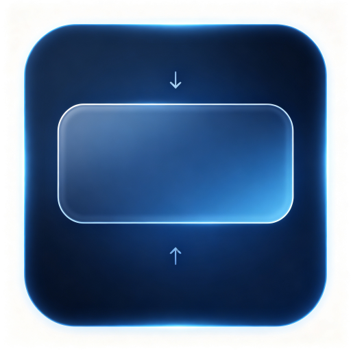

<h1>小组件布局</h1>

> [!NOTE]
> 当前版本 **1.0.2**，要求 Class Widgets 2 的插件 API `>=0.6.0`。

无组件界面的辅助插件。由Deepseek V4 Pro开发。

> 该插件不再更新，所有插件功能已转移至“Kryon的更多设置”

## 功能特色

为Class Widgets 2增加自定义小组件显示高度及隐藏深度功能，避免隐藏时出现漏字情况。

## 在主程序「设置 - 小组件布局」中提供两个调节项：

- **展示高度**：组件距屏幕顶部的距离（顶部停靠时生效，-1 为默认偏移）
- **隐藏深度**：隐藏时组件保留在屏幕边缘的宽度

插件加载时会自动为主程序 `WidgetsContainer.qml` 打入补丁（幂等，可重复加载），
使上述配置生效；若主程序还原了该文件，下次启动会自动重新打入。

> 修改配置后不需要重启主程序
